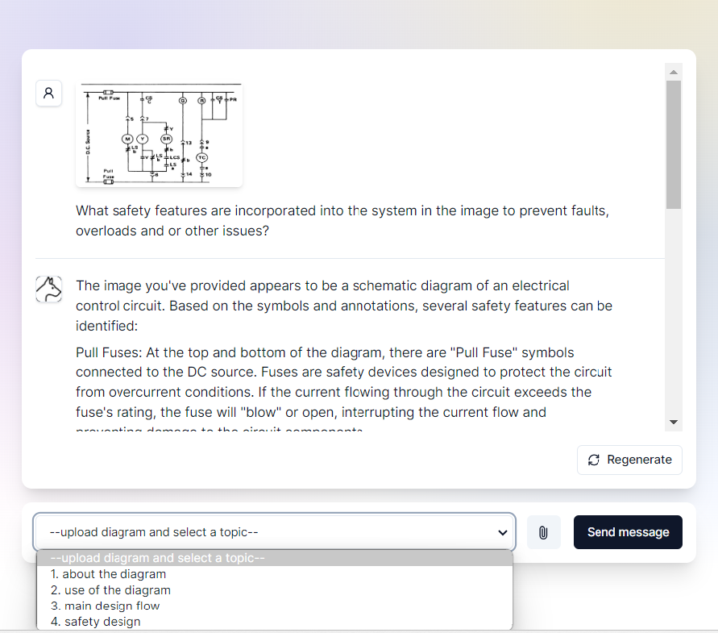

#  Electrical Diagram Reader 

```
-1. about the diagram

-2. use scenarios

-3. main design flow

-4. safety & feedback loops
```



## Support Devices
- iPAD Mini 6 (Safari)
- Windows Chrome (ver 120)

## Devlopment

First, install dependencies
```
npm install
```

Second, run the development server:

```
npm run dev
```

Open [http://localhost:3000](http://localhost:3000) with your browser to see the result.

## Cloud Deployment


-Railway
[](https://railway.app/template/qgg37j?referralCode=ChAPxC)

-Vercel

## Code Origin
```
LlamaIndex [`create-llama`](https://github.com/run-llama/LlamaIndexTS/tree/main/packages/create-llama) 
``````